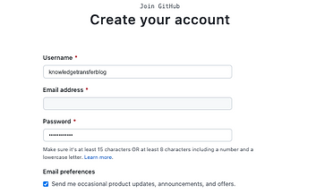
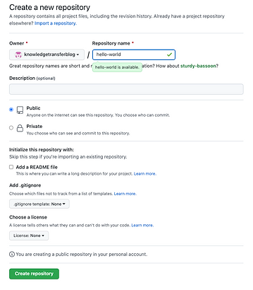

## Git Crash Course

### Contents

- Background 
- Setup 
- Fundamentals 
	1) Repositories (init, push, clone)
	2) Commits (add, commit, log)

#### Background

Git is software that tracks changes to your project. The 'changes' can be as small as a single character or the addition/deletion of entire files.

Git allows you to store these changes as commits, and track them in a history that can be shared among developers, allowing independent contributions to be merged in with those of other contributors. Frankly, there’s simply no alternative to managing the complexity of a software project at with multiple contributors.

There's an important distinction between "Git" and its commercial counterparts, "GitHub" and "GitLab." The latter two are commercial platforms that use Git software to provide cloud-based repository management.


It’s equally important to understand how to navigate these offerings as it is to understand the basics of Git, so this tutorial will include instructions on how to get setup with Github.

#### Setup

First, you’ll want to make sure you have the Git software installed on your computer. This process will vary depending on your operating system, so it’s easiest to just follow this tutorial: [https://github.com/git-guides/install-git](https://github.com/git-guides/install-git)

To verify that Git is installed you can open up your computer’s command line and type the following command. If it displays a numeric version then you are all set!

```sh
$ git –version
git version 2.35.1
```

The next step is to create a Github account. Remember, this Git-based offering will allow you to store a copy of your git repositories remotely on the web, and provide other very useful features!



[Link: https://github.com/join](https://github.com/join)

You will use your computer's command line to interact with your files and send your changes to Github. To simplify things, you can set up a credential store on your machine. Run the following commands. The first will configure a helper to store credentials locally. The second will prompt you for those credentials, and will store them automatically.

```sh
$ git config --global credential.helper store
$ git pull
```

The `–global` flag means that this configuration is saved across all repositories on your machine - removing it would only apply them to a single repo.

#### Fundamentals

There are a few key concepts that you really need to understand. However, as with most software concepts, I think it's easier to explain these as we progress.

##### Repositories

A repository in Git functions as a project folder, holding all necessary files like source code, READMEs, and potentially binaries or makefiles. It also tracks changes (additions, deletions, modifications) over time in the /.git directory.

To create a Git repository, use the command line to navigate to your project folder. Use ‘ls’ to list files, ‘cd’ to change directories, and ‘pwd’ to display your current path.

If you do not have a sample project folder, simply make one using the following command, then navigate into the folder.

```sh
$ mkdir hello-word
$ cd hello-world/
```

To turn this ordinary folder into a Git repository, use the `init` command.

```sh
$ git init
Initialized empty Git repository in /Users/brianbrown/hello-world/.git/
```

Now the .git file exists locally on your machine, and it will track changes to this repository over time. This is helpful for you to incrementally develop your project, but like we mentioned earlier, Git truly shines when you can push your repository to a remote location.

The most common way to accomplish this is through an internet hosted application like Github. Think of your local repository as a Microsoft Word document and Github as Google Drive.

Navigate to [https://github.com/new](https://github.com/new), and enter in a repository name (ensure this matches your local repository name). You shouldn't need to touch any other settings.



Once you create this, the instructions that Github provides under `…or push an existing repository from the command line` are sufficient.

```sh
$ git remote add origin https://github.com/knowledgetransferblog/hello-world.git
$ git branch -M main
$ git push -u origin main
```

The first command sets the remote origin for your local repository, specifying the GitHub location for publishing changes, but it doesn’t actually push any data.

To sync your local project with GitHub, use the push command with the -u flag to set the origin as your destination and specify the main branch.

We’ll cover branches in Part 2, but for now, note that you’re pushing to the main branch, where production-ready code typically resides.

In a company setting, you'll often clone existing repositories from GitHub to your computer rather than initializing new ones. To reflect local changes on GitHub, you'll need to push them manually.

Make sure you navigate outside of the `hello-world` repository first (use `cd ..` to travel out of a folder), then clone using the URL provided below for practice:

```sh
$ git clone https://github.com/brianbrown17/git-kt
```

##### Commits

To demonstrate commits, let's start by adding a new file to our `hello-world` repository.

```sh
$ echo "Hello world" > hello-world.txt
```

The `>` is a command-line function to send output (in this case the echoed message) to a destination (in this case a .txt file).

If you've made a change to your project, and you're happy with it, then next thing you'd want to do is `commit` it to the repository. But before you commit, use the `add` command to specify which files to include in Git's 'staging area'.

```sh
$ git add hello-world.txt
$ git commit -m "add: hello-world"
 1 file changed, 1 insertion(+)
 create mode 100644 hello-world.txt
```

It's important to use a descriptive commit message (here it follows the `-m` flag) to explain your changes.

So you've made a commit, what does that mean? Well, a commit is like a backup of all the staged changes of a project that's stored in the `/.git` file in your repository. It has information about who made the changes and when.

It also contains a commit hash. As you progress with Git you'll find it useful to be able to grab this hash. View all of this information using the `log` command.

```sh
$ git log
commit 7b8b5d950e04893aa4719e6913eccd6477b2bb40 (HEAD -> main)
Author: Brian <brianbrown@brian-computer.local>
Date:   Thu May 12 13:09:02 2022 -0400
    add: hello-world
```

One thing to note here, is that so far we've only made this commit to our local repository. If you were to check your Github repository at this point you wouldn't be able to see the `hello-world` text file. 

To update the remote repository, we're going to follow  the same command as before to push your changes. 

```sh
$ git push -u origin main
```

Remember, the upstream origin should still point to the Github URL of your remote repository, or something like: `https://github.com/<your_username>/hello-world`.  After you push, check to see that your files landed!

Congratulations! This simple foundation is enough for you to begin using Git/Github for your side projects. It can help you break work into smaller chunks, back it up in case of accidental deletion, and showcase your projects to others
